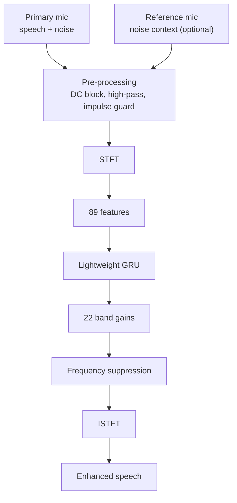

# CloudPlus: Real-Time Embedded Speech Enhancement for Defence Communication


CloudPlus is a real-time speech enhancement and adaptive noise cancellation system for communication in highly noisy environments.

It uses two MEMS microphones with an ESP32-S3. The **primary microphone** captures speech together with the surrounding noise, while the **second microphone** provides additional information about the acoustic environment. Audio is processed by lightweight DSP and a compact GRU-based neural network running on the embedded device.

> **Goal: reduce difficult background noise while keeping speech clear and intelligible.**

## Table of Contents

- [How It Works](#how-it-works)
- [Feature Extraction](#feature-extraction)
- [Neural Network](#neural-network)
- [Dataset](#dataset)
- [Evaluation Results](#evaluation-results)
- [Repository Structure](#repository-structure)
- [Hardware](#hardware)
- [Getting Started](#getting-started)
- [Current Status](#current-status)
- [Limitations](#limitations)
- [Team](#team)
- [References](#references)

## How It Works



The system processes incoming audio frame by frame (16 kHz, 10 ms hop).

The neural network **does not generate a new speech signal**. It predicts how strongly each frequency region should be attenuated or preserved.

The second microphone is **side information, not a subtraction reference**. It is never subtracted directly from the primary signal, so speech leaking into it cannot cancel the wanted speech, and the system keeps working when the reference is unavailable.

## Feature Extraction

The V3 pipeline builds an 89-dimensional feature vector for each frame. Audio is first converted to the frequency domain with an STFT.

| Feature | Count |
|---|---:|
| Mic 1 log-band energies | 22 |
| Mic 1 temporal deltas | 22 |
| Mic 2 log-band energies | 22 |
| Mic 1 to Mic 2 calibrated energy differences | 22 |
| Reference validity flag | 1 |
| **Total** | **89** |

The temporal features show how the signal changes over time. The Mic 1 / Mic 2 comparison gives extra information about the surrounding noise.

## Neural Network

The V3 model is deliberately compact for embedded use (**48,342 parameters**, about 47k multiply-accumulates per frame).

```text
89 input features
      |
Linear 89 -> 64
      |
ReLU + LayerNorm
      |
GRU 64 -> 64
      |
GRU 64 -> 48
      |
Linear 48 -> 22
      |
22 frequency-band gains
```

The two GRU layers give the model temporal memory, which helps with noise that changes over time instead of staying constant.

## Dataset

Training and evaluation use a mixture of speech, noise and room impulse response (RIR) datasets.

**Speech:** LibriSpeech, Common Voice Hindi

**Noise:** FSD50K, ESC-50, UrbanSound8K, DEMAND, MUSAN

**Room impulse responses:** SLR28, simulated RIRs, real RIRs

| Component | Amount |
|---|---:|
| Clean speech | 10.23 hours |
| Speech files | 6,148 |
| Noise samples | 19,538 |
| Simulated RIRs | 60,000 |
| Real RIRs | 218 |
| **Total RIRs** | **60,218** |

> The raw audio collection is **not included** in this repository because of its size. The repository contains the preprocessing code, manifests and metadata used to build the experiments.

## Evaluation Results

### Synthetic evaluation

The V3 system was evaluated on **2,500 test samples**.

| Metric | Result |
|---|---:|
| Mean SI-SNR improvement | +3.50 dB |
| SI-SNR improvement at -5 to 0 dB input SNR | +7.60 dB |
| Mean input STOI | 0.8991 |
| Mean output STOI | 0.9206 |
| Mean ΔSTOI | +0.0215 |

**By noise class**

| Noise class | ΔSI-SNR |
|---|---:|
| Ambient | +5.63 dB |
| Impulsive | +5.58 dB |
| Non-stationary | +5.39 dB |
| Stationary | +4.90 dB |

### Mic 2 evaluation

A separate A/B evaluation measured the contribution of the reference microphone.

| Configuration | Mean ΔSI-SNR |
|---|---:|
| Mic 2 OFF | +2.13 dB |
| Mic 2 ON | +3.50 dB |

At input SNRs of **0 dB or below**, Mic 2 gave an additional **+1.87 dB**. The second microphone helps in difficult conditions, and the system still operates when no reference is available.

### Clean-speech behaviour

A clean-speech probe checks that the model does not become overly aggressive when there is little noise to remove. Across tested levels from -50 to -15 dBFS:

- Minimum mean gain: **0.946**
- Maximum mean gain: **0.998**
- Output level error stayed within about **0.30 dB**

A noise suppressor should not simply make all incoming audio quieter.

### Real hardware testing

The system was tested on an ESP32-S3 prototype with two INMP441 MEMS microphones.

**Scenarios:** hostel/background speech, fan noise, fan + AC, military noise, impulsive noise, noise-only conditions

| Item | Value |
|---|---|
| Evaluation runs | 8 |
| Speech/noise scenarios | 6 |
| Input SNR range | about 7.9 to 10.5 dB |
| Average input SNR | about 9 dB |
| Bad packets | 0 during the recorded runs |

Metadata, telemetry and analysis results from these tests are in the repository (`results/`).

## Repository Structure

```text
.
├── firmware/
│   ├── include/
│   ├── src/
│   └── test/
├── ml/
│   ├── model.py
│   ├── features.py
│   ├── train.py
│   ├── evaluate.py
│   ├── exported_v3/
│   └── tools/
├── dataset/
│   ├── generated_v3/
│   ├── speech/
│   ├── noise_phase2/
│   └── rir/
├── results/
│   ├── real_hardware_summary.csv
│   └── stoi_v3/
├── docs/
├── legacy/
└── sync_capture_tool/
```

| Folder | Contents |
|---|---|
| `firmware/` | ESP32-S3 implementation: DSP front-end, neural-network inference, audio streaming |
| `ml/` | Model definition, feature extraction, training, evaluation, model export |
| `dataset/` | Dataset manifests and metadata (raw audio not included) |
| `results/` | Synthetic and real-hardware evaluation results |
| `docs/` | Experiment notes, implementation status, development documentation |
| `legacy/` | Older versions of the firmware and model pipeline |
| `sync_capture_tool/` | Tool for capturing synchronized primary / reference / clean audio from the device |

## Hardware

- ESP32-S3 development board
- 2 x INMP441 I2S MEMS microphones

The ESP32-S3 handles the embedded audio pipeline: microphone acquisition, preprocessing, feature extraction, neural-network inference and streaming.

## Getting Started

**Firmware** (PlatformIO):

```bash
cd firmware
pio run                 # build
pio run -t upload       # flash the ESP32-S3
pio device monitor      # serial log
```

**Model:** see `ml/train.py`, `ml/evaluate.py` and `ml/exported_v3/`. The raw audio used for training is not included; rebuild it from the manifests in `dataset/` once you have downloaded the public datasets listed above.

## Current Status

**Completed**

- [x] Dual-microphone audio acquisition
- [x] DSP preprocessing
- [x] 89-feature V3 pipeline
- [x] GRU-based V3 model
- [x] Embedded model export
- [x] ESP32-S3 firmware
- [x] Synthetic evaluation
- [x] STOI evaluation
- [x] Mic 2 A/B evaluation
- [x] Real-hardware capture and streaming tests

**Ongoing**

- [ ] Further embedded optimization (on-device latency and memory profiling)
- [ ] On-device enhancement metrics for the real-hardware scenarios
- [ ] More real-world test scenarios
- [ ] Improving performance at extremely low SNR
- [ ] Larger field evaluation

## Limitations

This is a **research prototype**.

- The results show measurable improvement, but performance at extremely low SNR needs more work. The best low-SNR result so far is +7.60 dB at -5 to 0 dB input SNR.
- The synthetic evaluation uses data from the same generator as training. The real-hardware evaluation set is much smaller and currently reports input SNR and stream integrity rather than output quality.
- Hindi and accented speech are used in training; the held-out test speech is mostly LibriSpeech.

All results reported here are measured results from the current V3 system.

## Team

**Team CloudPlus**, Smart India Hackathon 2026
Problem Statement: **SIH26052, DRDO**

## References

This project builds on research and datasets related to:

- Speech enhancement and band-gain (mask) estimation, e.g. J.-M. Valin, *A Hybrid DSP/Deep Learning Approach to Real-Time Full-Band Speech Enhancement* (RNNoise), 2018
- Short-Time Fourier Transform based audio processing
- GRU / recurrent neural networks (Cho et al., 2014)
- STOI speech intelligibility (Taal et al., 2011)
- Datasets: [LibriSpeech](https://www.openslr.org/12), [Common Voice](https://commonvoice.mozilla.org), FSD50K, [ESC-50](https://github.com/karolpiczak/ESC-50), UrbanSound8K, DEMAND, MUSAN, [SLR28](https://www.openslr.org/28)
